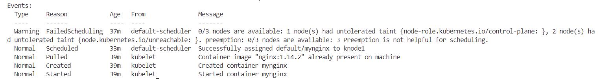
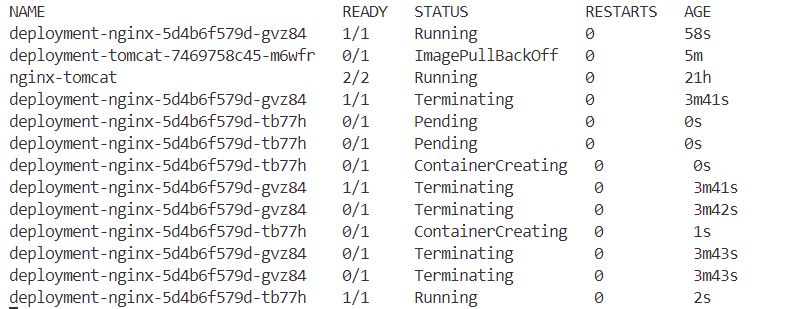
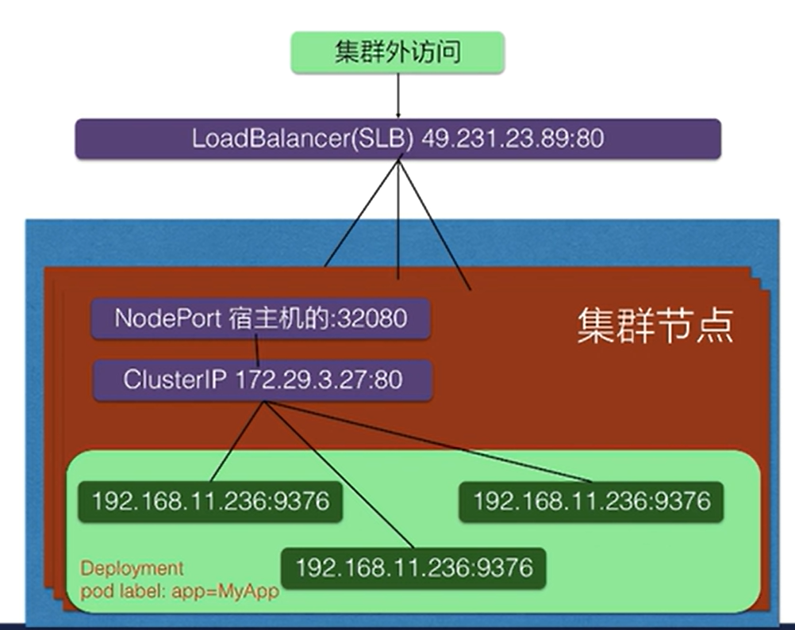

# 快速开始使用 k8s
### https://kubernetes.io/zh-cn/docs/home/ <br>
## 1 Namespace
```shell
cat > namespace.yaml << EOF
apiVersion: v1
kind: Namespace
metadata:
  name: test-ns
EOF

kubectl apply -f namespace.yaml
kubectl get ns

```

## 2 Pod
```shell
kubectl run mynginx --image nginx:1.14.2
kubectl run mynginx --image nginx:1.14.2 -n test

kubectl delete pod mynginx
kubectl describe pod mynginx
kubectl logs mynginx -n default

cat > pod.yaml << EOF
apiVersion: v1
kind: Pod
metadata:
  labels:
    run: nginx-tomcat
  name: nginx-tomcat
spec:
  containers:
  - name: nginx
    image: nginx:1.14.2
    ports:
    - containerPort: 80
  - name: tomcat
    image: tomcat
EOF

kubectl apply -f pod.yaml
```

```shell
# 查看 pod ip
kubectl get pods -owide
curl -v 10.244.195.136
curl -v 10.244.195.136:80
```
```shell
# 查看 pod ip
kubectl get pods -owide
curl -v 10.244.195.138
curl -v 10.244.195.138:80
curl -v 10.244.195.138:8080

kubectl exec -it nginx-tomcat -c nginx -- sh
kubectl exec -it nginx-tomcat -c tomcat -- sh

# tomcat 执行 证明 Pod 内部 容器之间的网络互通
curl localhost:80
```

## 3 Deployment
Deployment负责创建和更新应用程序的实例，使Pod拥有多副本，自愈，扩缩容等能力。创建Deployment后，Kubemetes Master 将应用程序实例调度
到集群中的各个节点上。如果托管实例的节点关闭或被删除，Deployment控制器会将该实例替换为群集中另一个节点上的实例。这提供了一种自我修复
机制来解决机器故障维护问题。I
```shell
kubectl create deployment deployment-tomcat --image=tomcat:9.0.55
kubectl create deployment deployment-nginx --image=nginx:1.14.2

# 另开窗监听
kubectl get pods -w
kubectl get deploy

kubectl delete pod  deployment-nginx-5d4b6f579d-gvz84
```


```shell
# 册除 deployment
kubectl delete deployment deployment-tomcat
kubectl delete deployment deployment-nginx
# 多副本
kubectl create deployment deployment-nginx --image=nginx:1.14.2 --replicas=3
kubectl describe pods deployment-nginx
```

```shell
cat > deployment.yaml << EOF
apiVersion: apps/v1
kind: Deployment
metadata:
  name: deployment-nginx
spec:
  replicas: 3
  selector:
    matchLabels:
      app: nginx
  template:
    metadata:
      labels:
        app: nginx
    spec:
      containers:
      - name: nginx
        image: nginx:1.14.2
        ports:
        - containerPort: 80
EOF

kubectl apply -f deployment.yaml

kubectl scale --replicas=5 deployment/deployment-nginx


kubectl set image deployment/deployment-nginx nginx=nginx:1.16.1 --record
kubectl get deployment deployment-nginx
kubectl describe pod deployment-nginx-595dff4fdb-v6zt5
kubectl rollout undo deployment/deployment-nginx
```

```shell
# 在每个节点上的一个端口（由 Kubernetes 随机选择）上创建一个 NodePort Service，从而暴露你的 Deployment。
kubectl expose deployment deployment-nginx --type=NodePort --port=80
kubectl delete service deployment-nginx

kubectl get svc

node1 192.168.1.201
service 10.97.28.153
pod 10.244.195.154

# pod
curl 10.244.195.154:80
# service
curl 10.97.28.153:80
# node
curl 192.168.1.200:32056
```

