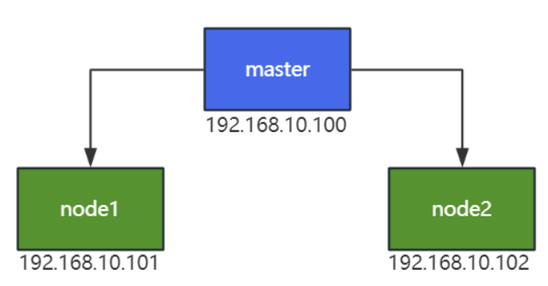
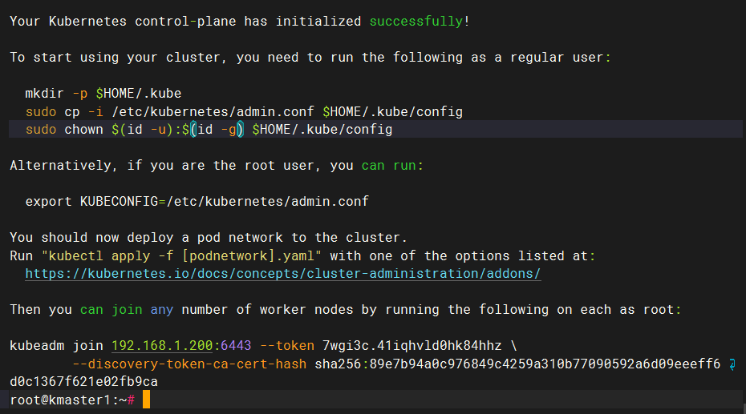

# ubuntu 22.04 k8s docker
### https://www.cnblogs.com/guangdelw/p/18222715 <br>
### https://blog.csdn.net/SeeYouGoodBye/article/details/135706243 <br>
 <br>
<br>
 <br>

## 一 系统初始化 🎰

### 1 base
```shell
sudo su
passwd root
apt update
apt install net-tools
apt install openssh-server
sed -i 's/^#\?PermitRootLogin .*/PermitRootLogin yes/' /etc/ssh/sshd_config
systemctl restart ssh
systemctl enable ssh
```

### 2 设置静态 IP 地址
```shell
cat >> /etc/netplan/00-installer-config.yaml << EOF
network:
  version: 2
  renderer: networkd
  ethernets:
    ens33:
      dhcp4: yes
      addresses:
        - 192.168.1.200/24
      routes:
        - to: 0.0.0.0/0
          via: 192.168.1.1
          metric: 100
      nameservers:
        addresses:
          - 8.8.8.8
          - 8.8.4.4
EOF

netplan apply
```

### 3 换源
```shell
cat << EOF > /etc/apt/sources.list
deb http://mirrors.aliyun.com/ubuntu/ jammy main restricted universe multiverse
deb http://mirrors.aliyun.com/ubuntu/ jammy-updates main restricted universe multiverse
deb http://mirrors.aliyun.com/ubuntu/ jammy-backports main restricted universe multiverse
deb http://mirrors.aliyun.com/ubuntu/ jammy-security main restricted universe multiverse

# 源码包（如果不需要，可以去掉）
deb-src http://mirrors.aliyun.com/ubuntu/ jammy main restricted universe multiverse
deb-src http://mirrors.aliyun.com/ubuntu/ jammy-updates main restricted universe multiverse
deb-src http://mirrors.aliyun.com/ubuntu/ jammy-backports main restricted universe multiverse
deb-src http://mirrors.aliyun.com/ubuntu/ jammy-security main restricted universe multiverse
EOF

apt-get update
```

### 4 修改主机名和 hosts
```shell
hostnamectl set-hostname kmaster1
cat >> /etc/hosts << EOF
192.168.1.200 kmaster1
192.168.1.201 knode1
EOF
```

### 5 关闭 swap
```shell
sed -ri 's/^([^#].*swap.*)$/#\1/' /etc/fstab && grep swap /etc/fstab && swapoff -a && free -h
```

### 6 设置内核参数
```shell
cat >> /etc/sysctl.conf <<EOF
vm.swappiness = 0
net.bridge.bridge-nf-call-iptables = 1
net.ipv4.ip_forward = 1
net.bridge.bridge-nf-call-ip6tables = 1
EOF

cat >> /etc/modules-load.d/neutron.conf <<EOF
br_netfilter
EOF

#加载模块
modprobe  br_netfilter
#让配置生效
sysctl -p
```

##  二 安装 k8s 组件 ✨

### 1 docker
```shell
apt update
apt install -y ca-certificates curl gnupg lsb-release
curl -fsSL https://download.docker.com/linux/ubuntu/gpg | sudo gpg --dearmor -o /usr/share/keyrings/docker-archive-keyring.gpg
echo "deb [arch=$(dpkg --print-architecture) signed-by=/usr/share/keyrings/docker-archive-keyring.gpg] https://download.docker.com/linux/ubuntu $(lsb_release -cs) stable" | sudo tee /etc/apt/sources.list.d/docker.list > /dev/null
apt-get update

sudo add-apt-repository "deb [arch=amd64] https://download.docker.com/linux/ubuntu $(lsb_release -cs) stable"
sudo apt install apt-transport-https ca-certificates curl software-properties-common
curl -fsSL https://download.docker.com/linux/ubuntu/gpg | sudo apt-key add -
sudo apt update
sudo apt-get update
apt install docker-ce docker-ce-cli containerd.io docker-compose -y

cat  << EOF > /etc/docker/daemon.json
{
"registry-mirrors": [
"https://docker.m.daocloud.io",
"https://index.docker.io/v1"
],
 "exec-opts": ["native.cgroupdriver=systemd"],
 "data-root": "/data/docker",
 "log-driver": "json-file",
 "log-opts": {
	 "max-size": "20m",
	 "max-file": "5"
	}
}
EOF
systemctl daemon-reload && systemctl restart docker
systemctl enable docker.service
docker info
```

### 2 安装最新版本的kubeadm、kubelet 和 kubectl
```shell
apt-get update && apt-get install -y apt-transport-https
curl -fsSL https://mirrors.aliyun.com/kubernetes-new/core/stable/v1.30/deb/Release.key |
    gpg --dearmor -o /etc/apt/keyrings/kubernetes-apt-keyring.gpg
echo "deb [signed-by=/etc/apt/keyrings/kubernetes-apt-keyring.gpg] https://mirrors.aliyun.com/kubernetes-new/core/stable/v1.30/deb/ /" |
    tee /etc/apt/sources.list.d/kubernetes.list
    
apt-get update
apt-get install -y kubelet kubeadm kubectl

systemctl enable kubelet
```

### 3 cri-dockerd
Kubernetes自v1.24移除了对docker-shim的支持，而Docker Engine默认又不支持CRI规范，<br>
因而二者将无法直接完成整合。为此，Mirantis和Docker联合创建了cri-dockerd项目，<br>
用于为Docker Engine提供一个能够支持到CRI规范的垫片，从而能够让Kubernetes基于CRI控制Docker。
```shell
wget https://github.com/Mirantis/cri-dockerd/releases/download/v0.3.14/cri-dockerd_0.3.14.3-0.ubuntu-jammy_amd64.deb
dpkg -i ./cri-dockerd_0.3.14.3-0.ubuntu-jammy_amd64.deb

sed -ri 's@^(.*fd://).*$@\1 --pod-infra-container-image registry.aliyuncs.com/google_containers/pause@' /usr/lib/systemd/system/cri-docker.service
systemctl daemon-reload && systemctl restart cri-docker && systemctl enable cri-docker
```

## 三 快照 node 节点 📷
### 1 配置 IP
```shell
# knode1
cat << EOF > /etc/netplan/00-installer-config.yaml
network:
  version: 2
  renderer: networkd
  ethernets:
    ens33:
      dhcp4: yes
      addresses:
        - 192.168.1.201/24
      routes:
        - to: 0.0.0.0/0
          via: 192.168.1.1
          metric: 100
      nameservers:
        addresses:
          - 8.8.8.8
          - 8.8.4.4
EOF
netplan apply
```
### 2 配置 节点 hostname
```shell
# knode1
hostnamectl set-hostname knode1
cat >> /etc/hosts << EOF
192.168.1.200 kmaster1
192.168.1.201 knode1
192.168.1.202 knode2
EOF
```

## 四 初始化 😀

### 主机 生成初始化配置文件
```shell
kubeadm init \
--kubernetes-version=v1.30.1 \
--image-repository registry.aliyuncs.com/google_containers \
--pod-network-cidr=10.24.0.0/16 \
--ignore-preflight-errors=Swap \
--cri-socket unix:///run/cri-dockerd.sock \
--v=10


mkdir -p $HOME/.kube
sudo cp -i /etc/kubernetes/admin.conf $HOME/.kube/config
sudo chown $(id -u):$(id -g) $HOME/.kube/config

# 检查是否成功
kubectl get nodes
```




```shell
# 删除重装 😭
systemctl stop kubelet
systemctl stop flanneld
systemctl stop etcd
systemctl stop kube-apiserver
systemctl stop kube-controller-manager
systemctl stop kube-scheduler
sudo kubeadm reset
sudo kubeadm init
sudo rm -rf /etc/kubernetes/
sudo rm -rf /var/lib/etcd/
rm -rf /etc/cni/net.d
rm -rf /var/lib/cni/
rm -rf /var/lib/kubelet/*
iptables -F
iptables -t nat -F
iptables -t mangle -F
iptables -X
rm -rf /var/lib/etcd
```

### node join
```shell
# 主机 生成 token
kubeadm token create --print-join-command

# 从机
kubeadm join 192.168.1.200:6443 \
--token 0gnn65.y8m0oii9hfw9lo1h \
--discovery-token-ca-cert-hash sha256:69e9c722de52eae210064a0a939d12c02440b3ede890de92abcd6b27083999ae \
--cri-socket unix:///run/cri-dockerd.sock

kubectl get nodes
kubectl get cs
```

### 安装 calico
```shell
wget https://docs.projectcalico.org/manifests/calico.yaml
vim calico.yaml 

# 修改 4061 行为 pod 子网地址
- name: CALICO_IPV4POOL_CIDR
  value: "10.24.0.0/16"
  
kubectl apply -f calico.yaml

watch kubectl get pods --all-namespaces -o wide
kubectl get nodes
kubectl get cs

kubectl run busybox --image busybox:1.28 --restart=Never --rm -it busybox -- sh
# 输入 nslookup kubernetes.default.svc.cluster.local
# 退出 exit
```
